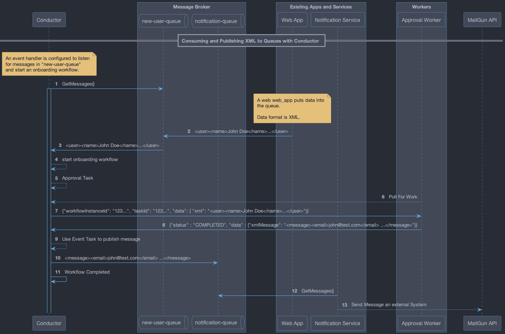

# Consuming and Publishing XML messages with Orkes Conductor

This project contains a [Worker](src/main/java/io/orkes/samples/workers/ApprovalWorker.java) and documentation which are
part of a [DEMO](https://drive.google.com/file/d/1iOCQaDi1ox29RbLZgHli78Osgd9igAAb/view?usp=sharing) that shows how to consume 
and publish messages in XML format using an [Event Handler](https://orkes.io/content/developer-guides/event-handler) and an
[Event Task](https://orkes.io/content/reference-docs/system-tasks/event) respectively.

The input and output of Workflows and Tasks in Orkes Conductor is always a JSON. However, if a message
is received that's not in JSON format, that message will be available as a string in the Workflow's input. 
To publish a string (XML or any other text format) you can use the special key `__payload` in the input of the Event task.

## Consuming

If the following XML is sent to a queue and is read by an event handler:

```xml
<user>
    <name>John Doe</name>
    <age>20</age>
    <email>john_doe@test.com</email>
    <created>2024-06-03 19:22:00</created>
</user>
```

The workflow input might look like this. As you can see `['conductor.event.eventPayload'].message` is set to the XML string:
```json
{
  "conductor.event.messageId": "BE1C55D1-F456-4279-945E-522DF9BABAA5",
  "conductor.event.name": "amqp:amqptest:new-user-queue",
  "conductor.event.eventPayload": {
    "_amqpMessageId": "BE1C55D1-F456-4279-945E-522DF9BABAA5",
    "_amqpType": null,
    "_amqpPriority": null,
    "_amqpUserId": null,
    "_amqpCorrelationId": null,
    "name": "amqp-event-handler-test",
    "_amqpConsumerTag": "amq.ctag-YFYBrKjnBFM88KvI47_7rw",
    "id": "BE1C55D1-F456-4279-945E-522DF9BABAA5",
    "message": "<user>\r\n    <name>John Doe</name>\r\n    <age>20</age>\r\n    <email>john_doe@test.com</email>\r\n    <created>2024-06-03 19:22:00</created>\r\n</user>\r\n",
    "event": "amqp:amqptest:new-user-queue"
  }
}
```

That message can be used like in the workflow definition as an input to a Task, e.g.:

```json
{
  "name": "approval_task",
  "taskReferenceName": "approval_ref",
  "inputParameters": {
    "data": "${workflow.input['conductor.event.eventPayload'].message}"
  },
  ...
}
```

## Publishing
To send an XML message to a queue you can use an Event task with the special key `__payload` just like in the [workflow definition](docs/definitions/workflow.json) used in the demo.

```json
 {
  "name": "event",
  "taskReferenceName": "event_ref",
  "inputParameters": {
    "__payload": "${approval_ref.output.notification}"
  },
  "type": "EVENT",
  "decisionCases": {},
  "defaultCase": [],
  "forkTasks": [],
  "startDelay": 0,
  "joinOn": [],
  "sink": "amqp:amqptest:notification-queue",
  "optional": false,
  "defaultExclusiveJoinTask": [],
  "asyncComplete": false,
  "loopOver": [],
  "onStateChange": {}
}

```

## Data flow

In this sequence diagram you can visualize the data flow which starts when an XML message is sent to a 
queue and ends when an Event Task is used to publish another XML message to a different queue.




### Notes
- This is available since Orkes Conductor `3.3.54`.
- In the demo `"data": "${workflow.input.payload.__payload}"` is used instead of `"data": "${workflow.input['conductor.event.eventPayload'].message}"`. 
That was only available during initial development of this feature (custom payload support) and ended up being deprecated to avoid increasing the size 
of the task payload unnecessarily.